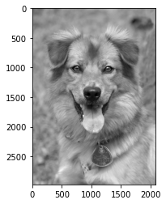
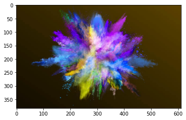
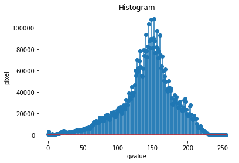
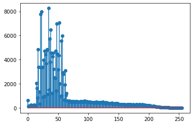
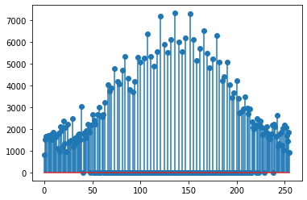

# Histogram and Histogram Equalization of an image
## Aim
To obtain a histogram for finding the frequency of pixels in an Image with pixel values ranging from 0 to 255. Also write the code using OpenCV to perform histogram equalization.

## Software Required:
Anaconda - Python 3.7

## Algorithm:
### Step1:
Import all the necessary libraries.
### Step2:
Read the images using imread() function.
### Step3:
Using calcHist() we can find the histogram of the images.
### Step4:
Using equalizeHist() we can equalize the image.
### Step5:
Using matplotlib.pyplot plot the histogram.
## Program:
```
# Developed By: Sai Darshan G
# Register Number:212221240047
import cv2
import matplotlib.pyplot as plt
# Write your code to find the histogram of gray scale image and color image channels. Display the histogram of gray scale image and any one channel histogram from color image.
import cv2
import matplotlib.pyplot as plt
image=cv2.imread("happy_dog.jpg")
color=cv2.imread("istockphoto-1140180560-612x612.jpg".)
hist=cv2.calcHist([image],[0],None,[256],[0,256])
hist1=cv2.calcHist([color],[1],None,[256],[0,256])
plt.imshow(image)
plt.show()
plt.imshow(color)
plt.show()
plt.figure()
plt.title("Histogram")
plt.xlabel("gvalue")
plt.ylabel("pixel")
plt.stem(hist)
plt.show()
plt.stem(hist1)
plt.show()
# Write the code to perform histogram equalization of the image. 
import cv2
import matplotlib.pyplot as plt
image=cv2.imread("happy_dog.jpg",0)
equ=cv2.equalizeHist(image)
equ1=cv2.resize(equ, (780, 540),interpolation = cv2.INTER_NEAREST)
egray=cv2.imshow("equ",equ1)
hist=cv2.calcHist([equ1],[0],None,[256],[0,256])
plt.stem(hist)
plt.show()
cv2.waitKey(0)
cv2.destroyAllWindows()
```
## Output:
### Input Grayscale Image and Color Image


### Histogram of Grayscale Image and any channel of Color Image


### Histogram Equalization of Grayscale Image

## Result: 
Thus the histogram for finding the frequency of pixels in an image with pixel values ranging from 0 to 255 is obtained. Also,histogram equalization is done for the gray scale image using OpenCV.
